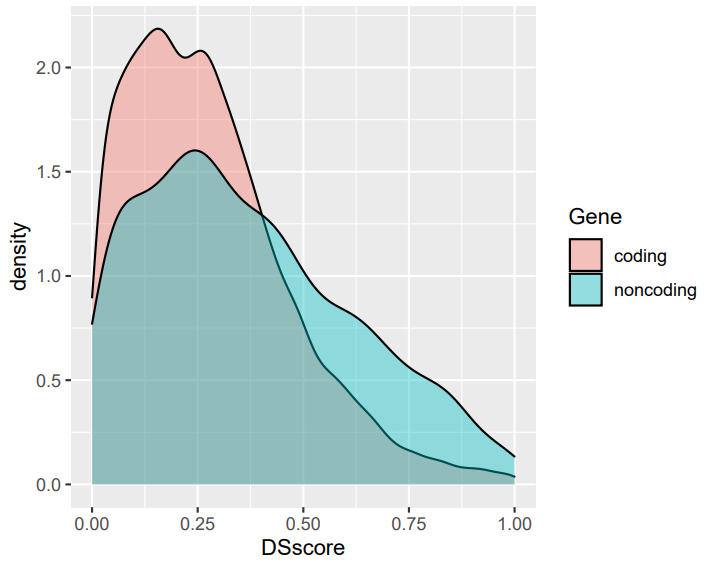

Disease specificity analysis of lncRNA through integrative analysis of RNA-Seq datasets
================

##### Liu Huiting (2022/05/07)

### Introduction

dslnc package is designed to retrieve known and novel long noncoding RNAs (lncRNAs) transcripts and analyze the disease-specific lncRNAs in multiple diseases through integrative analysis of RNA-seq data from an organ system. It also provides utilities for functional annotation of disease-specific lncRNAs. We believe that dslnc can accelerate the fundamental research in dissecting the functional role of lncRNAs in human diseases.

### Requirement

To run dslnc package, please install the following requirements.

+ [FASTQ](Version 0.11.8)
+ [HISAT2] (v2.0.5)
+ [STRINGTIE] (v1.3.1 )
+ [SAMTOOLS] (v0.1.19)
+ [FeatureCounts] (v2.0.1)
+ [Bedtools] (https://github.com/arq5x/bedtools2)
+ [ISeeRNA] (http://www.myogenesisdb.org/iSeeRNA)
+ [Rscript] (r-3.6.0)
+ [GTF] (hg19) (you can download from [https://gitee.com/hui-tingzi/test/blob/master/data/refGene.rar](https://gitee.com/hui-tingzi/test/blob/master/data/refGene.rar))

### Preparation of Testing dataset

```bash
# Disease1: https://sra-downloadb.be-md.ncbi.nlm.nih.gov/sos3/sra-pub-run-20/SRR8052751/SRR8052751.1
# Disease2: https://sra-downloadb.be-md.ncbi.nlm.nih.gov/sos2/sra-pub-run-15/SRR8052708/SRR8052708.1

cd dslnc/data
mkdir srr
wget https://sra-downloadb.be-md.ncbi.nlm.nih.gov/sos3/sra-pub-run-20/SRR8052751/SRR8052751.1
wget https://sra-downloadb.be-md.ncbi.nlm.nih.gov/sos2/sra-pub-run-15/SRR8052708/SRR8052708.1

# you can download sra-toolkits (https://hpc.nih.gov/apps/sratoolkit.html).
fastq-dump --split-files SRR8052751.1
fastq-dump --split-files SRR8052708.1
```

### Getting start

#### A.input data preparation

Prepare the samples.lst file.
The samples.lst file format should be prepared as follows:

```bash
CTRL_002_healthy	../data/srr/SRR8052751_1.fastq	../data/srr/SRR8052751_2.fastq
AD_004_lesional	../data/srr/SRR8052708_1.fastq	../data/srr/SRR8052708_2.fastq
```

#### B.prepare the config.txt file

Write the configure file, please refer to a template of [the config.txt file](https://gitee.com/hui-tingzi/test/blob/master/bin/config.txt).
Please prepare config.txt file as follows: 

```bash
# parameter_id<tab>path_to_directory or exec program
OUTDIR  ./out
SAMPLE  ./samples.lst

# parameter
READLEN 150
MINLEN  60
THREAD  24

# program setting
BIN     bin
FASTQC  fastqc
HISAT2  hisat2
STRINGTIE       stringtie
SAMTOOLS        samtools
HOMER   /homer/bin

# for STAR
GTF     ../data/refGene.gtf
SPE     human
INDEX   ../data/hisat2_index/hg19
CHROMSIZE       ../data/hg19/hg19.chrom.size

# for dslnc analysis
Chr     ../data/chr.lst
Bedtools        bedtools
ISeeRNA iSeeRNA
Iseerna_conf    ../data/iseerna.conf
FeatureCounts   featureCounts
Rscript Rscript
```

#### C.create makefile for dslnc analysis. 

Create a makefile and run dslnc analysis automatically.

```bash
# Create a makefile
perl ../bin/dslnc.pl ../bin/config.txt 

# run dslnc analysis
sh ../bin/auto_run.sh
```

Please make sure the directory looks like as follows:

```bash
├── out
│   ├── 1.standard
│   │   ├── CTRL_001_health
│   │   │   ├── 00datafilter
│   │   │   ├── 01alignment
│   │   │   ├── 02assembly
│   │   │   └── makefile
│   │   ├── makefile
│   │   └── PCA_002_lesional
│   │       ├── 00datafilter
│   │       ├── 01alignment
│   │       ├── 02assembly
│   │       └── makefile
│   ├── 2.identification
│   │   └── makefile
│   ├── 3.filter
│   │   └── makefile
│   └── 4.ds_score
│       └── makefile
└── samples.lst
```

------------------------------------------------------------------------

### Run dslnc analysis step by step

#### Preparation of testing dataset 

If you would like to use example data for practicing the workflow, please download human RNAseq datasets from NCBI.

```bash
Disease1: https://sra-downloadb.be-md.ncbi.nlm.nih.gov/sos3/sra-pub-run-20/SRR8052751/SRR8052751.1
Disease2: https://sra-downloadb.be-md.ncbi.nlm.nih.gov/sos2/sra-pub-run-15/SRR8052708/SRR8052708.1
```

#### Prepare samples.lst and config.txt files

Please prepare these files as mentioned in "Getting start" part.

#### Step 1. RNAseq analysis

#### Command

```bash
# create makefile for RNA-seq analysis.
perl ../bin/dslnc.pl ../bin/config.txt
sh out/1.standard/standard.sh

# run RNA-seq analysis for all samples
cd out/1.standard && make && cd -
```

#### Output

In this step, it will run RNA-seq analysis in all samples one by one. It might take a long time in this step depending on your computer resource.
You can obtain a transcriptome assembly for each sample.

```bash
├── out
│   ├── 1.standard
│   │   ├── CTRL_001_health
│   │   │   ├── 00datafilter
│   │   │   ├── 01alignment
│   │   │   ├── 02assembly
│   │   │   └── makefile
│   │   ├── makefile
│   │   └── PCA_002_lesional
│   │       ├── 00datafilter
│   │       ├── 01alignment
│   │       ├── 02assembly
│   │       └── makefile
│   ├── 2.identification
│   │   └── makefile
│   ├── 3.filter
│   │   └── makefile
│   └── 4.ds_score
│       └── makefile
└── samples.lst
```
------------------------------------------------------------------------

#### Step 2. Identification of novel lncRNAs

#### Command

```bash
cd out/2.identification && make && cd -
```

#### Output

We combine all transcriptome assemblies and predict novel lncRNAs, please refer to test/out/2.identification/novo.lncrna.lst. This step also generate a merged gtf for all the samples, which can be found at test/out/2.identification/all.final.gtf.

```bash
├── 2.identification
│   ├── 00changebed.finished
│   ├── 00changegtf.finished
│   ├── 00getchr.finished
│   ├── 00rmknown.finished
│   ├── 00stringtie.finished
│   ├── 01getnovel.finished
│   ├── 01getnovelgtf.finished
│   ├── 01iseerna.finished
│   ├── 02changebed.finished
│   ├── 02getalllnclst.finished
│   ├── 02getfinalgtf.finished
│   ├── 02getgtf.finished
│   ├── 02getknownlnc.finished
│   ├── 02getknownlncgtf.finished
│   ├── 02getmergegtf.finished
│   ├── 02getnovellncgtf.finished
│   ├── 02rmIntergeniclnc.finished
│   ├── abinit.iseerna.novo.out
│   │   ├── 01make.finished
│   │   ├── abinit.merged.cl.novo.fa
│   │   ├── abinit.merged.cl.novo.feature
│   │   ├── abinit.merged.cl.novo.gtf
│   │   ├── abinit.merged.cl.novo.list
│   │   ├── abinit.merged.cl.novo.orf
│   │   ├── abinit.merged.cl.novo.predict
│   │   ├── abinit.merged.cl.novo.result
│   │   ├── abinit.merged.cl.novo.result.0.8.filtered
│   │   ├── abinit.merged.cl.novo.scaled
│   │   ├── abinit.merged.cl.novo.svm
│   │   ├── all_abinit.merged.cl.novo.consv
│   │   ├── consv
│   │   │   ├── chr10.consv
│   │   │   ├── chr10.dat
│   │   │   ├── chr10.list
│   │   │   ├── chr11.consv
│   │   │   ├── chr11.dat
│   │   │   ├── chr11.list
│   │   │   ├── chr12.consv
│   │   │   ├── chr12.dat
│   │   │   ├── chr12.list
│   │   │   ├── chr13.consv
│   │   │   ├── chr13.dat
│   │   │   ├── chr13.list
│   │   │   ├── chr14.consv
│   │   │   ├── chr14.dat
│   │   │   ├── chr14.list
│   │   │   ├── chr15.consv
│   │   │   ├── chr15.dat
│   │   │   ├── chr15.list
│   │   │   ├── chr16.consv
│   │   │   ├── chr16.dat
│   │   │   ├── chr16.list
│   │   │   ├── chr17.consv
│   │   │   ├── chr17.dat
│   │   │   ├── chr17.list
│   │   │   ├── chr18.consv
│   │   │   ├── chr18.dat
│   │   │   ├── chr18.list
│   │   │   ├── chr19.consv
│   │   │   ├── chr19.dat
│   │   │   ├── chr19.list
│   │   │   ├── chr1.consv
│   │   │   ├── chr1.dat
│   │   │   ├── chr1.list
│   │   │   ├── chr20.consv
│   │   │   ├── chr20.dat
│   │   │   ├── chr20.list
│   │   │   ├── chr21.consv
│   │   │   ├── chr21.dat
│   │   │   ├── chr21.list
│   │   │   ├── chr22.consv
│   │   │   ├── chr22.dat
│   │   │   ├── chr22.list
│   │   │   ├── chr2.consv
│   │   │   ├── chr2.dat
│   │   │   ├── chr2.list
│   │   │   ├── chr3.consv
│   │   │   ├── chr3.dat
│   │   │   ├── chr3.list
│   │   │   ├── chr4.consv
│   │   │   ├── chr4.dat
│   │   │   ├── chr4.list
│   │   │   ├── chr5.consv
│   │   │   ├── chr5.dat
│   │   │   ├── chr5.list
│   │   │   ├── chr6.consv
│   │   │   ├── chr6.dat
│   │   │   ├── chr6.list
│   │   │   ├── chr7.consv
│   │   │   ├── chr7.dat
│   │   │   ├── chr7.list
│   │   │   ├── chr8.consv
│   │   │   ├── chr8.dat
│   │   │   ├── chr8.list
│   │   │   ├── chr9.consv
│   │   │   ├── chr9.dat
│   │   │   ├── chr9.list
│   │   │   ├── chrM.consv
│   │   │   ├── chrM.dat
│   │   │   ├── chrM.list
│   │   │   ├── chrX.consv
│   │   │   ├── chrX.dat
│   │   │   ├── chrX.list
│   │   │   ├── chrY.consv
│   │   │   ├── chrY.dat
│   │   │   ├── chrY.list
│   │   │   └── Makefile
│   │   ├── iSeeRNA.conf
│   │   └── Makefile
│   ├── abinit.merged.cl.bed
│   ├── abinit.merged.cl.gtf
│   ├── abinit.merged.cl.novo.bed
│   ├── abinit.merged.cl.novo.gtf
│   ├── abinit.merged.gtf
│   ├── abinit.new.gtf
│   ├── all.final.gtf
│   ├── all.final.lncgeneid.lst
│   ├── all.lncRNA.gtf
│   ├── lncRNA.trans.gtf
│   ├── lncRNA.trans.lst
│   ├── makefile
│   ├── novo.rna.gtf
│   ├── novo.trans.bed
│   ├── novo.trans.gtf
│   ├── novo.trans.non-ol.bed
│   └── novo.trans.non-ol.gtf
```

------------------------------------------------------------------------

#### Step 3. Filtering low expressed lncRNAs

#### Command

```bash
cd out/3.filter && make && cd -
```
#### Output

This step will quatify the expression level of all lncRNAs, please refer to ./test/out/3.filter/fpkm_result.txt. On the other hand, lncRNAs and protein coding genes (PCGs) with low expression levels will be filtered out (please refer to: /test/out/3.filter/all.lncRNA.filter.fpkm.txt and /test/out/3.filter/all.pcg.filter.fpkm.txt).

```bash
├── 3.filter
│   ├── 00featurecount.finished
│   ├── 01counttofpkm.finished
│   ├── 01getheader.finished
│   ├── 01getsampleid.finished
│   ├── 01rmheader.finished
│   ├── 02filter.finished
│   ├── 02getallfpkm.finished
│   ├── 02getalllncfpkm.finished
│   ├── 02lncfilter.finished
│   ├── 03getpcgfpkm.finished
│   ├── 03getpcglst.finished
│   ├── 03pcgfilterfpkm.finished
│   ├── all.lncRNA.filter.fpkm.txt
│   ├── all.lncRNA.fpkm.txt
│   ├── all.pcg.filter.fpkm.txt
│   ├── count.txt
│   ├── count.txt.summary
│   ├── fpkm_result.txt
│   ├── header.txt
│   ├── makefile
│   ├── pcg.fpkm.txt
│   └── refgene.codingene.lst
```
------------------------------------------------------------------------

#### Step 4. Disease-specificity score (DS score) calculation

#### Command

```bash
cd out/4.ds_score && make && cd -
```

#### Output

The disease-specificity score of lncRNAs and protein coding genes is in test/out/4.ds_score/all.lncRNA.filter.dsscore.txt and test/out/4.ds_score/all.pcg.filter.dsscore.txt, respectively. destiny.pdf shows the comparion of DS score distribution between lncRNAs and protein coding genes.

```bash
└── 4.ds_score
    ├── 01getavg.finished
    ├── 01getlncavg.finished
    ├── 01lncds.finished
    ├── 02ds.finished
    ├── 02getpcgavg.finished
    ├── 02pcgds.finished
    ├── 03destiny.finished
    ├── 03getallscore.finished
    ├── 03getlncscore.finished
    ├── 03getpcgscore.finished
    ├── 03rmheader.finished
    ├── all.gene.filter.score.txt
    ├── all.lncRNA.filter.avg.fpkm.txt
    ├── all.lncRNA.filter.dsscore.txt
    ├── all.pcg.filter.avg.fpkm.txt
    ├── all.pcg.filter.dsscore.txt
    ├── codingscore.txt
    ├── destiny.pdf
    ├── makefile
    ├── noncodingscore.txt
    └── Rplots.pdf
```


The format of disease-specifity score result.

```bash
#{id}\tab{disease1}\tab{disease2}\tab{DS_scor _of_gene}\tab{most_specific_disease}
LOC100133091            0.851892614542727               2.8187855877881 0.896895005858782	disease1	
LOC101928126            3.02669783420868                1.16114685818554        0.86991908642307        disease2
RALY-AS1                1.06407345733899                1.59204120009034        0.773022319339166	disease1
AS-PTPRE                2.0092520953125         1.42828260748092        0.75973106098206        disease2
```

This density plot shows DS score of lncRNAs (green) compared with PCGs (pink).




------------------------------------------------------------------------

### Please cite

Liu et al. 2022 The long noncoding RNA atlas in healthy and diseased skin (manuscript in preparation).


